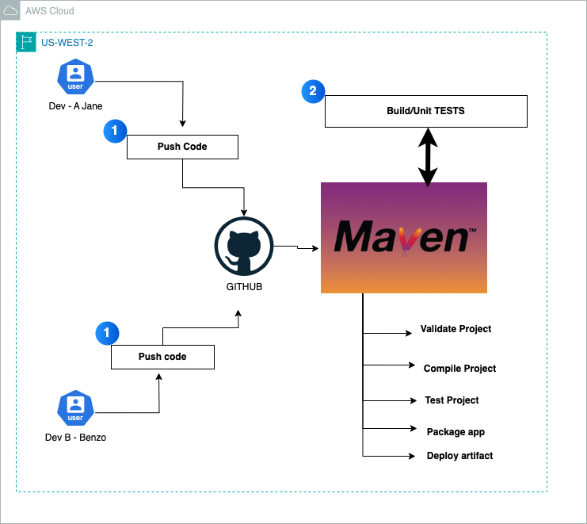

# Maven-Learning-Repo
- This repo is maintained by [Devops with Mike](https://www.youtube.com/@DevOpsWithMike0/videos/)
- For interview preparation, use this platform [Wandaprep](http://www.wandaprep.com/)
- Visit my website for more inquiries and support [DevOpswithMike](https://devopswithmike.tech/).

## Introduction
Apache Maven is a popular open-source build automation and dependency management tool, particularly for Java-based projects. Maven uses a file called pom.xml (Project Object Model) as its configuration to manage project structure, dependencies, plugins, and lifecycle phases in a unified way.

 Official [Maven](https://maven.apache.org/guides/introduction/introduction-to-the-lifecycle.html) documentation

## Background
Maven was initially developed to simplify the project build process by eliminating the complexity of managing project dependencies and builds. It leverages a "Convention over Configuration" approach, which standardizes the project structure and lifecycle, making it easier for developers to manage builds and dependencies without excessive configuration.

The Apache Software Foundation maintains Maven, and it’s widely adopted across the Java ecosystem. Maven's core functionality revolves around dependency management and automation of repetitive tasks, which are essential in software development, especially in environments with large-scale, multi-module projects.

## Maven Architecture
Maven repository is a place where the maven artefacts or dependencies of the JAR file is going to store which are written in the file called the `POM.XML`. `POM.XML `contains the Java classes, resources, and other dependencies.There are the two types of repositories like


Maven reads the `pom.xml` file.Maven downloads the dependencies defined in the `pom.xml` file into the local repository from the central or remote repository.Maven executes the life cycles, phases, goals, and plugins defined in the `pom.xml` file.

**Sample `pom.xml` file**

```
<project xmlns="http://maven.apache.org/POM/4.0.0">
    <modelVersion>4.0.0</modelVersion>
    <groupId>com.example</groupId>
    <artifactId>demo-application</artifactId>
    <version>1.0.0</version>
    <packaging>jar</packaging>
    <name>Demo Application</name>

    <!-- Set Java and Spring Boot versions -->
    <properties>
        <java.version>11</java.version>
        <spring-boot.version>2.5.4</spring-boot.version>
    </properties>

    <!-- Dependencies for Spring Boot and Testing -->
    <dependencies>
        <dependency>
            <groupId>org.springframework.boot</groupId>
            <artifactId>spring-boot-starter-web</artifactId>
        </dependency>
        <dependency>
            <groupId>org.springframework.boot</groupId>
            <artifactId>spring-boot-starter-test</artifactId>
            <scope>test</scope>
        </dependency>
    </dependencies>

    <!-- Build plugins for Spring Boot, Java compilation, and SonarQube analysis -->
    <build>
        <plugins>
            <plugin>
                <groupId>org.springframework.boot</groupId>
                <artifactId>spring-boot-maven-plugin</artifactId>
            </plugin>
            <plugin>
                <groupId>org.apache.maven.plugins</groupId>
                <artifactId>maven-compiler-plugin</artifactId>
                <version>3.8.1</version>
                <configuration>
                    <source>${java.version}</source>
                    <target>${java.version}</target>
                </configuration>
            </plugin>
            <plugin>
                <groupId>org.sonarsource.scanner.maven</groupId>
                <artifactId>sonar-maven-plugin</artifactId>
                <version>3.9.1.2184</version>
            </plugin>
        </plugins>
    </build>

    <!-- Nexus repository deployment configuration -->
    <distributionManagement>
        <repository>
            <id>nexus-releases</id>
            <url>http://localhost:8081/repository/maven-releases/</url>
        </repository>
        <snapshotRepository>
            <id>nexus-snapshots</id>
            <url>http://localhost:8081/repository/maven-snapshots/</url>
        </snapshotRepository>
    </distributionManagement>

    <!-- Profiles for SonarQube and Nexus credentials -->
    <profiles>
        <profile>
            <id>sonar</id>
            <properties>
                <sonar.host.url>http://localhost:9000</sonar.host.url>
                <sonar.login>${env.SONAR_TOKEN}</sonar.login>
            </properties>
        </profile>
        <profile>
            <id>nexus</id>
            <properties>
                <nexus.username>${env.NEXUS_USERNAME}</nexus.username>
                <nexus.password>${env.NEXUS_PASSWORD}</nexus.password>
            </properties>
        </profile>
    </profiles>
</project>

```

**Summary of Key Parts**
- **Project Information**: Contains groupId, artifactId, and version to uniquely identify the project.
- **Dependencies**: Essential Spring Boot and testing dependencies.
- **Build Plugins**:
    - *Spring Boot Plugin*: Packages the application as an executable JAR.
    - *Maven Compiler Plugin*: Specifies Java version for compilation.
    - *SonarQube Plugin*: Enables SonarQube analysis.
- **Distribution Management**: Configures Nexus endpoints for deploying releases and snapshots.
- **Profiles**:
    - *SonarQube*: Contains SonarQube server URL and token.
    - *Nexus*: Sets Nexus credentials using environment variables.

## Why Use Maven?
- **Dependency Management**: Maven can easily manage and download project dependencies, reducing the manual effort required to locate, download, and update dependencies.
- **Build Lifecycle Management**: Maven standardizes build processes, so project compilation, packaging, testing, and deployment are consistent across different environments.
- **Build Consistency**: Following Maven conventions allows for consistent builds across development environments.
- **Wide Ecosystem Support**: Maven integrates seamlessly with many IDEs, CI/CD tools, and other build automation tools.

## Maven Lifecycle Phases
- **Maven's build process is organized into several lifecycle phases**. Each phase performs specific actions in a well-defined order. Below are the main Maven lifecycles:

1. **Default Lifecycle**
This is the main lifecycle that covers project build and deployment:

- *`validate`*: Validates the project is correct and all necessary information is available.
- *`compile`*: Compiles the source code of the project.
- *`test`*: Tests the compiled source code using a suitable unit testing framework.
- *`package`*: Packages the compiled code into a distributable format, such as a JAR or WAR file.
- *`verify`*: Runs checks to verify the integrity and quality of the packaged artifact.
- *`install`*: Installs the package into the local repository for use as a dependency in other local projects.
- *`deploy`*: Copies the packaged artifact to a remote repository for sharing with other developers or projects.

2. **Clean Lifecycle**
The *clean* lifecycle handles project cleaning:

- *`pre-clean`*: Executes actions needed before cleaning.
- *`clean`*: Removes all files generated by the previous build.
- *`post-clean`*: Executes actions needed after the clean process.

3. **Site Lifecycle**
The *site* lifecycle manages the creation of the project's documentation:

- *`pre-site`*: Executes processes needed before generating site documentation.
- *`site`*: Generates project documentation.
- *`post-site`*: Executes actions needed after generating documentation.
- *`site-deploy`*: Deploys the generated documentation to a web server or repository.

## Key Features
- **Dependency Management**: Manages dependencies for third-party libraries, handling them in `pom.xml`.
- **Build Lifecycle Management**: Supports a well-defined lifecycle to handle project builds.
- **Extensible Plugins**: Provides plugins for compilation, testing, packaging, and deployment.
- **Repository Management**: Integrates with local, central, and remote repositories (e.g., Maven Central, Nexus, Artifactory).
- **Documentation Generation**: Generates project documentation based on metadata from `pom.xml`.

## Use Cases
1. **Java Project Build and Management**
Maven is ideal for Java project builds, including large-scale, multi-module applications. Its dependency management simplifies library imports, and the default lifecycle ensures consistent builds across different teams.

2. **Dependency Management**
Maven automates dependency management, downloading dependencies from repositories as specified in the pom.xml file. Maven manages transitive dependencies, pulling in dependencies of your dependencies as needed.

3. **Continuous Integration (CI)**
With tools like Jenkins, GitLab CI, and GitHub Actions, Maven enables automated CI processes by supporting build, test, and deployment tasks. CI tools often support Maven commands natively, enabling consistent and repeatable builds.

4. **Code Quality Analysis**
Maven integrates with code quality tools like SonarQube and Checkstyle to enforce coding standards, identify bugs, and improve maintainability. The SonarQube Maven plugin, for instance, sends code analysis reports to a SonarQube server.

5. **Package and Release Management**
Maven supports packaging and releasing Java applications in standard formats (JAR, WAR). Artifacts can be deployed to repositories like Nexus, providing a centralized location for sharing libraries or application packages within an organization.

## Integration with DevOps Tools
1. **Jenkins**
Maven integrates seamlessly with Jenkins for automated builds in CI/CD pipelines. Jenkins can be configured to execute Maven goals (e.g., clean, install, deploy) on code pushes, providing quick feedback to developers and ensuring project integrity.

*Example Jenkins Pipeline*:

```
pipeline {
    agent any
    stages {
        stage('Build') {
            steps {
                sh 'mvn clean install'
            }
        }
        stage('Test') {
            steps {
                sh 'mvn test'
            }
        }
        stage('Deploy') {
            steps {
                sh 'mvn deploy'
            }
        }
    }
}

```

2. **SonarQube**
Maven integrates with SonarQube for code quality analysis. Using the sonar-maven-plugin, Maven can analyze code and send quality metrics to SonarQube, enabling tracking of code health and adherence to best practices.

*Example Command*:
```
mvn sonar:sonar -Dsonar.projectKey=your_project_key -Dsonar.host.url=http://localhost:9000 -Dsonar.login=your_token

```

3. **Nexus Repository**
Nexus Repository Manager is used to host and manage Maven artifacts. Maven can be configured to deploy artifacts (e.g., JAR/WAR files) to a Nexus repository, making them accessible for other developers and projects.

*Example Configuration in `pom.xml`*:

```
<distributionManagement>
    <repository>
        <id>nexus</id>
        <url>http://localhost:8081/repository/maven-releases/</url>
    </repository>
</distributionManagement>
```
4. **Docker**
Maven can also be combined with Docker for containerization of Java applications. A Dockerfile can be added to a Maven project to define the container environment, enabling consistent application deployment.

*Example Dockerfile*:
```
Dockerfile
Copy code
FROM openjdk:11
COPY target/demo-0.0.1-SNAPSHOT.jar demo.jar
ENTRYPOINT ["java","-jar","/demo.jar"]
```
5. **GitHub Actions**
Maven is also compatible with GitHub Actions for CI/CD workflows. A GitHub Action workflow can run Maven commands to automate build, test, and deployment.

`Example GitHub Workflow`:
```
name: Java CI with Maven
on:
  push:
    branches: [ main ]
  pull_request:
    branches: [ main ]

jobs:
  build:
    runs-on: ubuntu-latest
    steps:
    - uses: actions/checkout@v2
    - name: Set up JDK 11
      uses: actions/setup-java@v2
      with:
        java-version: '11'
        distribution: 'adopt'
    - name: Build with Maven
      run: mvn clean install
```

# Development Environment Project


###### Project ToolBox 🧰
- [Git](https://git-scm.com/) Git will be used to manage our application source code.
- [Github](https://github.com/) Github is a free and open source distributed VCS designed to handle everything from small to very large projects with speed and efficiency
- [Maven](https://maven.apache.org/) Maven will be used for the application packaging and building including running unit test cases
- [EC2](https://aws.amazon.com/ec2/) EC2 allows users to rent virtual computers (EC2) to run their own workloads and applications.

## Configure Environments
1) **Create a GitHub Repository**
    - Navigate to https://github.com
    - Click on Repositories
    - Click on `Create` to Create a Repository
     - Repository Name: maven-learning-project
     - Click on `Create`
     - Download the Project Zip from https://github.com/devopsmike-01/maven-learning-repo.git
     - Unzip and Push the code to the Repository you just provisioned

2) **Setting up Maven Server**
    - Create an Amazon Linux 2 VM instance and call it "maven-server"
    - Instance type: t2.micro
    - Security Group (Open): 22 to 0.0.0.0/0 or Your-IP
    - Key pair: Select or create a new keypair
    - Follow the installation steps in this repo: https://github.com/devopsmike-01/maven-learning-repo/blob/main/Maven-installation/maven-install.md
    - Launch Instance
    
**Conclusion**
Apache Maven is an essential tool for managing Java projects, providing dependency management, build automation, and integration with various DevOps tools. By following a standardized build lifecycle, Maven simplifies complex build processes, ensuring consistent and reproducible builds across teams. Its ability to integrate with CI/CD systems, code quality tools, and artifact repositories makes it indispensable for modern Java-based DevOps pipelines.
